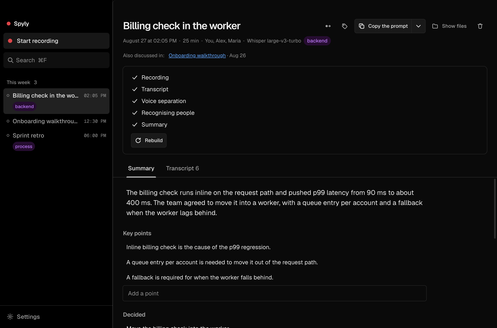

# Spyly

**Records your calls, transcribes them speaker by speaker, and hands the conversation to your coding agent.**

Everything runs on your machine. No account, no API key, no audio leaving the computer.

[Русская версия](README.ru.md)



---

A call is a finished spec that nobody writes down. Spyly records it, works out who said what, and puts the result where Claude Code and Codex can read it — so "we agreed to move the billing check into the worker" becomes a task instead of a memory.

## What it does

- **Records you and the room on separate tracks.** The microphone and the system audio are captured independently, so the transcript knows who spoke and speaker echo never doubles a phrase.
- **Splits both tracks by voice.** Several people around one microphone in a meeting room get separated too.
- **Shows text while you talk.** Words appear as they are spoken — measured 0.5–0.8 s behind speech on an M-series Mac.
- **Learns people's voices.** Name someone once; from the next recording their name fills itself in from the voice print.
- **Removes speaker bleed.** Without headphones your microphone hears the other side. Spyly compares levels between the two tracks and drops the echo.
- **Notices a call starting** — the microphone being taken by another app, browser calls included.
- **Names the recording by what was discussed** once the transcript is ready.
- **Serves everything over MCP**: 14 tools, so an agent can ask about any past conversation.
- **Speaks Russian and English.** The interface language is a setting; recordings keep whatever language was spoken.

## Install

macOS 14.2+ (Apple silicon). Windows and Linux targets are configured but not verified yet.

```bash
npm install
npm run build:native        # Swift capture helper + whisper.cpp with Metal
npm run build
npm run dist:mac -w @spyly/desktop
```

The `.dmg` lands in `release/`. `build:native` clones whisper.cpp at a pinned commit into `native/whisper` on first run — it is a separate project with its own history and licence, so it is not vendored here.

On first launch macOS asks for two permissions: the microphone, and system audio recording. On macOS 15+ the second one lives in **Privacy & Security → Screen & System Audio Recording → System Audio Recording Only**.

## Connecting an agent

```bash
claude mcp add spyly -- /Applications/Spyly.app/Contents/Resources/bin/spyly-mcp
```

For Codex, the app's settings screen shows the snippet for `~/.codex/config.toml`. Claude Desktop is one button in the same place.

| Tool | What it answers |
|---|---|
| `stats`, `digest` | how much was recorded, what is still unprocessed |
| `list_meetings`, `search` | find a conversation by time, participant, or words in it |
| `get_transcript`, `get_summary` | the conversation itself, whole or by speaker or by time range |
| `list_tasks`, `add_task`, `complete_task` | what was promised out loud, across every recording |
| `list_participants`, `tag_meeting`, `update_summary` | who talks to you, and corrections to what the machine wrote |
| `ask_meeting`, `current_recording` | a question about one recording; what is being recorded right now |

Dates are understood in words — "today", "last week", "3 days" — or as ISO. Transcript contents are marked as data: anything can be said in a call, and the agent must not take it for an instruction.

The same is available in a terminal:

```bash
spyly list
spyly last | claude -p "turn this into tickets"
spyly search "billing"
```

## How it works

```
microphone ─┐
            ├─→ two WAV tracks ─→ transcription ─→ voice separation ─→ people ─→ summary
system audio ┘        │
                      └─→ streaming model ─→ live text while you speak
```

Files are the source of truth. A recording is a folder you can copy, hand to an agent, or read yourself:

```
~/Spyly/meetings/2026-08-27--billing-worker--a1b2/
  meta.json          what, when, who, processing state
  audio/             mic.wav and system.wav, 16 kHz mono
  transcript.json    speakers, utterances, word timings
  transcript.md      the same for people and agents
  summary.md
```

### Why system audio needs a Swift helper

On macOS 26 the Chromium path (`getDisplayMedia` with `audio: 'loopback'`) does not work: the audio track arrives already ended, and the internal CoreAudio tap permission probe fails silently — the app gets a live but empty stream. Verified on Electron 44 across every combination of flags and constraints.

The helper takes its own tap (`AudioHardwareCreateProcessTap` into a private aggregate device), which also gives per-application capture that Chromium has no API for at all.

### Recognition models

Downloaded on first run into `~/Library/Application Support/Spyly/models`.

| Model | Why you'd pick it | Size |
|---|---|---|
| Whisper large-v3-turbo | default: accuracy and speed, 99 languages | 574 MB |
| Whisper large-v3 | more accurate on poor audio, about twice as slow | 1.0 GB |
| GigaAM v3 | best Russian, punctuation included | 500 MB |
| Parakeet TDT v3 | much faster than Whisper, 25 languages | 638 MB |
| Nemotron Speech 3.5 | streaming — this is what live text runs on | 475 MB |

Voice separation uses pyannote segmentation 3.0 (7 MB) and 3D-Speaker embeddings (40 MB).

### Made-up text

Whisper was trained partly on subtitles, and on silence it emits the most likely string from that training data: subtitle credits, "Thanks for watching", "Продолжение следует…". Neither the `no-speech` threshold nor non-speech token suppression stops it, and whisper.cpp's built-in VAD crashes on real audio.

So the filtering is ours, in two layers: a track with no speech is never sent for recognition, and finished utterances are checked against known signatures and against the actual energy under them. A signature glued to real speech is cut out rather than dragging the whole utterance away with it.

### Summaries without keys

Anthropic and OpenAI have no public OAuth for third-party apps, only API keys. Three ways around that:

- **Claude Code** or **Codex** if installed — already authorised by your subscription, Spyly just calls them;
- **Ollama** — fully local, no account at all;
- an API key if you want a specific provider. Keys live in the system keychain and are never read back into the interface.

## Shortcuts

| Keys | |
|---|---|
| `⌘⇧R` | start or stop recording, from any application |
| `⌘M` | mark an important moment while recording |
| `⌘Z` / `⌘⇧Z` | undo or redo an edit to a recording |
| `⌘F` | search |
| `⌘,` | settings |

## Privacy

Transcription and voice separation run locally by default. Voice prints are biometrics: they stay on this computer, go to no cloud provider, and can be deleted from settings. The calendar is read-only and only around the current moment.

The app is deliberately visible while recording — the tray icon changes, and a reminder to tell the other side appears before it starts. In many jurisdictions recording a conversation without telling the participants is illegal.

## Licence

[GNU AGPL-3.0-or-later](LICENSE). Copyright © 2026 Dmitry Ganin.

You may use, study, change and share this program. Anything built on it must be released under the same licence, including a service that runs it over a network — a closed-source fork is not permitted.

For use without those obligations, a commercial licence is available: open an issue or write to [@AppsGanin](https://github.com/AppsGanin).

Third-party parts keep their own licences: whisper.cpp is MIT, sherpa-onnx is Apache-2.0, the Geist fonts are under the SIL Open Font License. Recognition models are downloaded at runtime and carry their own terms — GigaAM in particular is not licensed for commercial use.

## Development

```bash
npm run dev -w @spyly/desktop
npm test          # 185 unit tests
npm run typecheck
```

End-to-end check — a real recording, transcription and voice separation, 87 assertions:

```bash
npx electron apps/desktop --selftest path/to/file.wav 25
```

The file is played by an external process, so what gets verified is the actual system-audio capture rather than fixtures pushed into the pipeline.

```
apps/desktop/          Electron: capture, pipeline, interface
  src/main/audio       wrapper over the native helper, WAV writing
  src/main/pipeline    transcribe → voices → people → summary
  src/main/providers   pluggable engines, local and cloud
native/macos-audio/    Swift: system audio and microphone capture
native/whisper/        whisper.cpp, statically built with Metal
packages/core/         data model, track merging, formats, Geist tokens
packages/mcp-server/   MCP server over the recordings folder
packages/cli/          the `spyly` command
```
