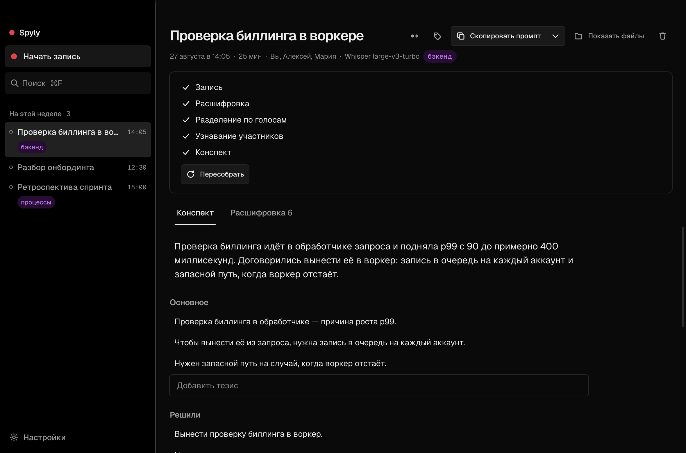

# Spyly

**Записывает разговоры, расшифровывает обе стороны и отдаёт готовый текст кодинг-агенту.**

Всё считается на вашем компьютере. Без аккаунта, без ключей, звук никуда не уходит.

[English](README.md)



---

Разговор — это готовое техзадание, которое никто не записывает. Spyly пишет его, разбирает, кто что сказал, и кладёт результат туда, откуда его прочитают Claude Code и Codex: «договорились перенести проверку биллинга в воркер» становится задачей, а не воспоминанием.

## Что умеет

- **Пишет вас и собеседника раздельно.** Микрофон и системный звук — две независимые дорожки, поэтому видно, какая сторона что сказала, и эхо не удваивает фразы.
- **Показывает текст по ходу разговора.** Слова появляются, пока вы говорите: замер на Mac с процессором Apple — 0.5–0.8 секунды.
- **Снимает эхо динамиков.** Без наушников микрофон слышит собеседника; Spyly сравнивает громкость двух дорожек и убирает повтор.
- **Замечает начало разговора** по тому, что микрофон занят другим приложением, — включая разговоры в браузере.
- **Называет запись по смыслу**, когда расшифровка готова.
- **Отдаёт всё через MCP**: 14 инструментов, чтобы агент мог спросить про любой прошлый разговор.
- **Говорит по-русски и по-английски.** Язык интерфейса — настройка; записи остаются на том языке, на котором говорили.

## Установка

macOS 14.2 и новее, Apple silicon. Сборки под Windows и Linux настроены, но пока не проверены.

```bash
npm install
npm run build:native        # Swift-хелпер захвата и whisper.cpp с Metal
npm run build
npm run dist:mac -w @spyly/desktop
```

Готовый `.dmg` появится в `release/`. `build:native` при первом запуске клонирует whisper.cpp на закреплённом коммите в `native/whisper` — это отдельный проект со своей историей и лицензией, поэтому копии его исходников здесь нет.

При первом запуске macOS попросит два разрешения: микрофон и запись системного звука. На macOS 15+ второе живёт в разделе **«Конфиденциальность и безопасность» → «Запись экрана и системного звука» → «Только запись системного звука»**.

## Подключение агента

```bash
claude mcp add spyly -- /Applications/Spyly.app/Contents/Resources/bin/spyly-mcp
```

Для Codex сниппет в `~/.codex/config.toml` показан в настройках приложения. Claude Desktop подключается там же одной кнопкой.

| Инструмент | На что отвечает |
|---|---|
| `stats`, `digest` | сколько записано, что ещё не обработано |
| `list_meetings`, `search` | найти разговор по времени, участнику или словам в нём |
| `get_transcript`, `get_summary` | сам разговор — целиком, по стороне или по куску времени |
| `list_tasks`, `add_task`, `complete_task` | что было обещано голосом, по всем записям сразу |
| `list_participants`, `tag_meeting`, `update_summary` | с кем вы говорите и правки к тому, что написала машина |
| `ask_meeting`, `current_recording` | вопрос по одной записи; что пишется прямо сейчас |

Даты понимаются словами — «сегодня», «неделя», «за 3 дня» — или в ISO. Содержимое расшифровок помечено как данные: в разговоре может прозвучать что угодно, и агент не должен принимать это за указание.

То же самое доступно в терминале:

```bash
spyly list
spyly last | claude -p "сделай тикеты"
spyly search "биллинг"
```

## Как устроено

```
микрофон ────┐
             ├─→ две дорожки WAV ─→ расшифровка ─→ снятие эха ─→ конспект
системный ───┘        │
    звук              └─→ потоковая модель ─→ живой текст, пока вы говорите
```

Файлы — источник правды. Запись это папка, которую можно скопировать, отдать агенту или прочитать самому:

```
~/Spyly/meetings/2026-08-27--billing-worker--a1b2/
  meta.json          что за разговор, когда, кто, состояние обработки
  audio/             mic.wav и system.wav — 16 кГц, моно
  transcript.json    две стороны, реплики, времена слов
  transcript.md      то же для человека и для агента
  summary.md
```

### Почему системный звук берёт свой Swift-хелпер

На macOS 26 путь через Chromium (`getDisplayMedia` с `audio: 'loopback'`) не работает: аудиодорожка приходит сразу завершённой, а внутренняя проба разрешений CoreAudio-тапа падает молча — приложение получает живой, но пустой поток. Проверено на Electron 44 со всеми сочетаниями флагов и ограничений.

Свой тап (`AudioHardwareCreateProcessTap` в приватное составное устройство) работает и заодно даёт захват отдельных приложений, чего у Chromium нет вовсе.

### Модели распознавания

Скачиваются при первом запуске в `~/Library/Application Support/Spyly/models`.

| Модель | Чем хороша | Размер |
|---|---|---|
| Whisper large-v3-turbo | по умолчанию: точность и скорость, 99 языков | 574 МБ |
| Whisper large-v3 | точнее на плохом звуке, примерно вдвое медленнее | 1.0 ГБ |
| Parakeet TDT v3 | заметно быстрее Whisper, 25 языков | 638 МБ |
| Nemotron Speech 3.5 | потоковая — на ней работает живой текст | 475 МБ |


### Выдумки распознавания

Whisper учился в том числе на субтитрах и на тишине выдаёт самую вероятную строку из обучающих данных: подписи авторов субтитров, «Продолжение следует…», в английском — «Thanks for watching». Ни порогом `no-speech`, ни подавлением неречевых токенов это не лечится, а встроенный VAD whisper.cpp падает на реальном звуке.

Поэтому отсев свой, в два слоя: дорожка без речи вообще не отдаётся в распознавание, а готовые реплики проверяются и по известным подписям, и по фактической громкости под ними. Подпись, приклеившуюся к живой речи, вырезают — а не выбрасывают вместе с ней всю реплику.

### Конспект без ключей

У Anthropic и OpenAI нет публичного OAuth для сторонних приложений — только ключи. Обойтись без них можно тремя способами:

- **Claude Code** или **Codex**, если установлены: они уже авторизованы вашей подпиской, Spyly просто вызывает их;
- **Ollama** — полностью локально, без аккаунта вообще;
- ключ провайдера, если нужен конкретный API. Ключи лежат в системном хранилище и в интерфейс не возвращаются.

## Горячие клавиши

| Сочетание | |
|---|---|
| `⌘⇧R` | начать или остановить запись из любого приложения |
| `⌘M` | отметить важное место во время записи |
| `⌘F` | поиск |
| `⌘,` | настройки |

## Приватность

Расшифровка по умолчанию идёт локально. О голосе не хранится ничего: две стороны разговора следуют из двух дорожек, и слепку голоса просто неоткуда взяться. Календарь читается только на чтение и только вокруг текущего момента.

Приложение намеренно заметно во время записи: иконка в трее меняется, а перед стартом показывается напоминание предупредить собеседников. Во многих юрисдикциях запись разговора без уведомления участников незаконна.

## Лицензия

[GNU AGPL-3.0-or-later](LICENSE). © 2026 Дмитрий Ганин.

Программу можно использовать, изучать, менять и распространять. Всё, что на ней построено, обязано выходить под той же лицензией — включая сервис, который работает по сети. Закрытая копия невозможна.

Если нужны условия без этих обязательств, есть коммерческая лицензия: заведите issue или напишите [@AppsGanin](https://github.com/AppsGanin).

Чужие части сохраняют свои лицензии: whisper.cpp под MIT, sherpa-onnx под Apache-2.0, шрифты Geist под SIL Open Font License. Модели распознавания скачиваются при работе и живут по своим условиям.

## Разработка

```bash
npm run dev -w @spyly/desktop
npm test          # 185 юнит-тестов
npm run typecheck
```

Сквозная проверка тракта — настоящая запись, расшифровка и конспект:

```bash
npx electron apps/desktop --selftest путь/к/файлу.wav 25
```

Файл проигрывается внешним процессом, поэтому проверяется именно захват системного звука, а не подстановка готовых данных в конвейер.

```
apps/desktop/          Electron: захват, конвейер, интерфейс
  src/main/audio       обёртка над нативным хелпером, запись WAV
  src/main/pipeline    расшифровка → голоса → участники → конспект
  src/main/providers   подключаемые движки: локальные и облачные
native/macos-audio/    Swift: захват системного звука и микрофона
native/whisper/        whisper.cpp, собранный статически с Metal
packages/core/         модель данных, слияние дорожек, форматы, токены Geist
packages/mcp-server/   MCP-сервер поверх папки с записями
packages/cli/          команда `spyly`
```
